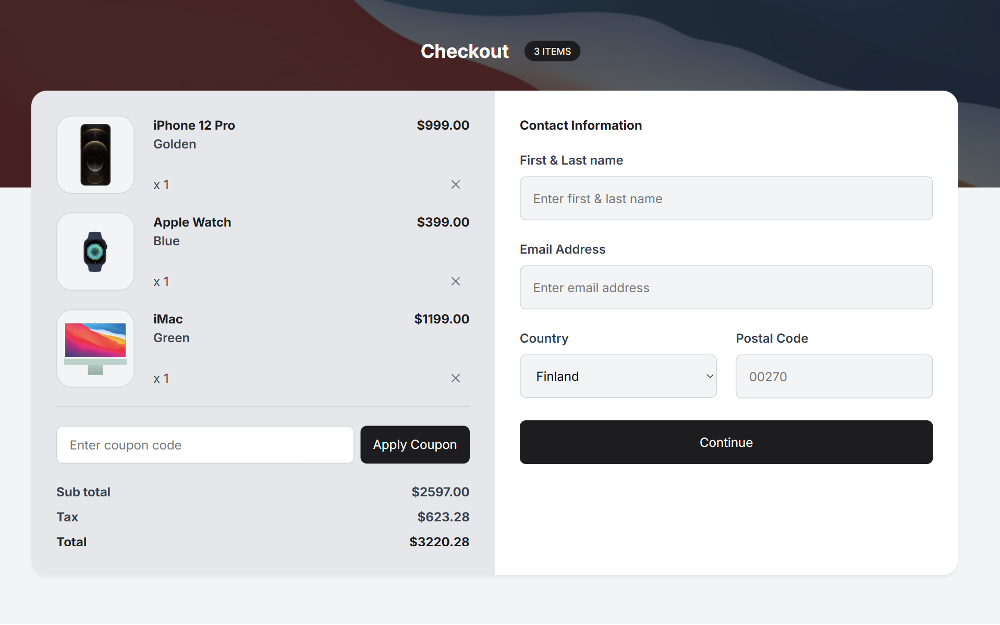
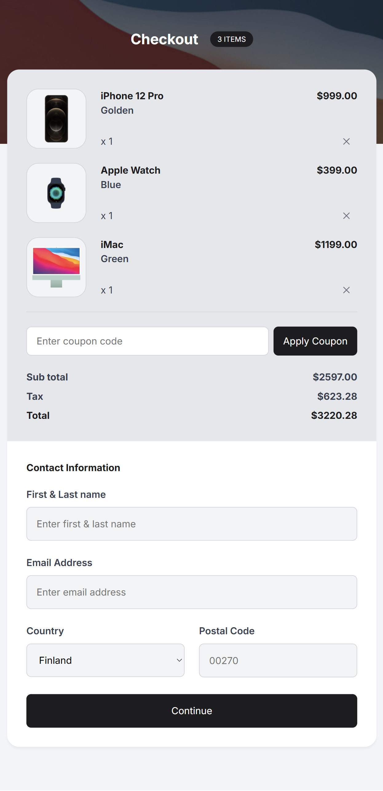

<!-- Please update value in the {}  -->

<h1 align="center">Device Shop Checkout | devChallenges</h1>

<div align="center">
   Solution for a challenge <a href="https://devchallenges.io/challenge/apple-shop-checkout-page-challenge" target="_blank">Device Shop Checkout</a> from <a href="http://devchallenges.io" target="_blank">devChallenges.io</a>.
</div>

<div align="center">
  <h3>
    <a href="https://h-yoshikawa44.github.io/ch-device-shop-checkout/">
      Demo
    </a>
    <span> | </span>
    <a href="https://devchallenges.io/solution/49746">
      Solution
    </a>
    <span> | </span>
    <a href="https://devchallenges.io/challenge/apple-shop-checkout-page-challenge">
      Challenge
    </a>
  </h3>
</div>

<!-- TABLE OF CONTENTS -->

## Table of Contents

- [Table of Contents](#table-of-contents)
- [Overview](#overview)
  - [Desktop](#desktop)
  - [Mobile](#mobile)
  - [What I learned](#what-i-learned)
  - [Built with](#built-with)
- [Features](#features)
- [How To Use](#how-to-use)
- [Acknowledgements](#acknowledgements)
- [Author](#author)

<!-- OVERVIEW -->

## Overview

<!--
Introduce your projects by taking a screenshot or a gif. Try to tell visitors a story about your project by answering:

- What have you learned/improved?
- Your wisdom? :)
-->

### Desktop



### Mobile



### What I learned

<!-- Use this section to recap over some of your major learnings while working through this project. Writing these out and providing code samples of areas you want to highlight is a great way to reinforce your own knowledge. -->

- Review of element placement control by position: absolute.

### Built with

<!-- This section should list any major frameworks that you built your project using. Here are a few examples.-->

Base

- [HTML](https://developer.mozilla.org/ja/docs/Web/HTML)
- [CSS](https://developer.mozilla.org/ja/docs/Web/CSS)
- [Node.js](https://nodejs.org/): 22.15.0
- [Vite](https://ja.vitejs.dev/)

Other major libraries

- [Lightning CSS](https://lightningcss.dev/)

## Features

<!-- List the features of your application or follow the template. Don't share the figma file here :) -->

This application/site was created as a submission to a [DevChallenges](https://devchallenges.io/challenges-dashboard) challenge.

- [x] Build an Apple shop checkout page website with a top navigation, summary section, and contact form section.
- [x] Use fundamental CSS techniques like Grid and Flexbox to structure the layout.
- [x] Display all the products in the summary section.
- [x] Collect user information such as name, email, and country in the contact form section.
- [x] Style the layout to be responsive and adapt to different screen sizes.
- [x] Practice styling forms and fundamental CSS techniques like Grid and Flex.
- [x] Ensure the website is accessible and user-friendly.
- [x] Test the website on different devices and screen sizes to ensure responsiveness.
- [x] Optimize the website for performance and loading speed.
- [x] Use semantic HTML elements to structure the content and improve SEO.
- [x] Apply CSS styles to enhance the visual presentation of the Apple shop checkout page elements.
- [x] Validate the HTML and CSS code to ensure it follows best practices and standards.
- [x] (Optional) Add hover effects or animations to make the website more interactive.
- [x] Document the code and provide clear instructions on how to run and use the website.
- [x] Deploy the website to make it accessible for everyone.

## How To Use

Install dependencies
```bash
npm i
```

Run the Vite
```bash
npm run dev
```

## Acknowledgements

<!-- This section should list any articles or add-ons/plugins that helps you to complete the project. This is optional but it will help you in the future. For exmpale -->

（none in particular）

## Author

- Website: [h-yoshikawa44.com](https://h-yoshikawa44.com)
- GitHub: [@h-yoshikawa44](https://github.com/h-yoshikawa44)
- X: [@yoshi44_lion](https://x.com/yoshi44_lion)
